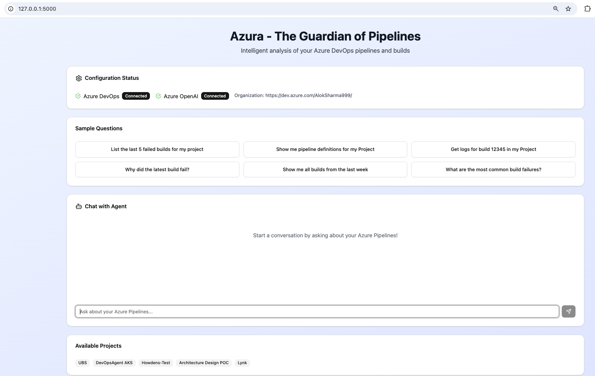
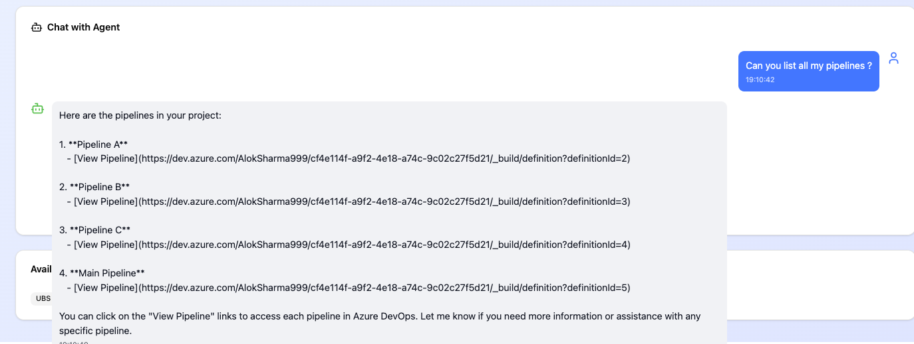
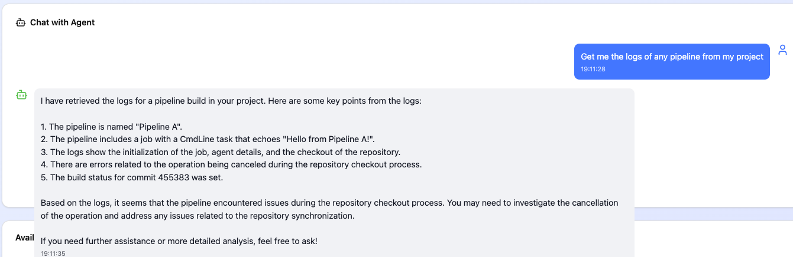
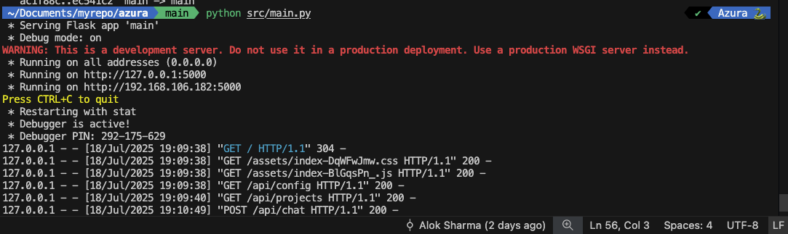
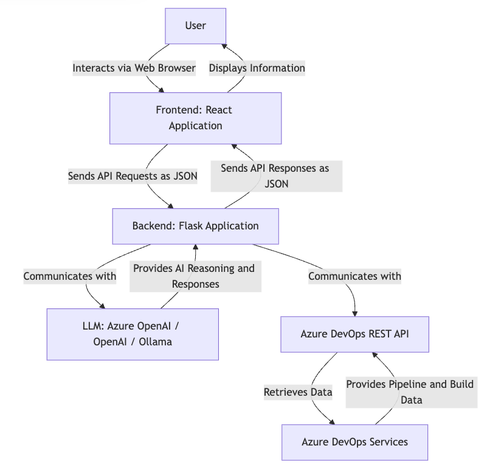

# Azura - The Guardian of Pipelines


## Project Overview

**Azura - The Guardian of Pipelines** is an intelligent agentic AI tool designed to streamline the analysis of Azure DevOps Pipelines. In complex development environments with numerous pipelines, identifying the root cause of build failures or extracting specific information can be a time-consuming and challenging task. Azura aims to simplify this process by leveraging the power of Large Language Models (LLMs) and integrating directly with the Azure DevOps REST API.

This application provides a user-friendly web interface where developers and operations teams can interact with an AI agent using natural language queries. Instead of manually sifting through extensive build logs or navigating complex Azure DevOps portals, users can simply ask questions like "Why did the last build fail for project X?" or "List all successful builds for pipeline Y in the last week." The agent will then intelligently process these requests, fetch relevant data from Azure DevOps, analyze it using an LLM, and provide concise, actionable insights.










## Key Features

*   **Natural Language Interaction:** Communicate with the agent using plain English queries, making it accessible to users of all technical backgrounds.
*   **Intelligent Build Failure Analysis:** Automatically analyze build logs and identify potential root causes of failures, providing explanations and suggestions for resolution.
*   **Comprehensive Pipeline Information Retrieval:** Easily fetch details about builds, pipeline definitions, and project status without manual navigation.
*   **Flexible LLM Integration:** Supports various Large Language Models, including Azure OpenAI, OpenAI (via their public API), and local models like Ollama, allowing users to choose based on cost, privacy, and performance preferences.
*   **User-Friendly Web Interface:** A modern React-based frontend provides an intuitive chat experience and clear display of information.
*   **Configurable Environment:** Easily configure Azure DevOps credentials and LLM settings via environment variables.
*   **Optimized Log Analysis (Future Enhancement):** Designed with the capability to focus analysis on specific failed tasks or stages within a pipeline to minimize token consumption and improve efficiency.

## Why Azura?

In today's fast-paced DevOps landscape, quick identification and resolution of pipeline issues are critical. Azura acts as your personal AI assistant, reducing the time spent on debugging and information retrieval, thereby allowing your teams to focus more on development and innovation. By centralizing analysis and leveraging AI, Azura enhances productivity, reduces operational overhead, and provides deeper insights into your CI/CD processes.


## Architecture

Azura is built as a full-stack web application, separating the user interface from the core logic and data interactions. This architecture ensures scalability, maintainability, and flexibility in integrating various services.



**Key Components:**

*   **Frontend (React):** A modern, responsive Single-Page Application (SPA) built with React. It provides the interactive chat interface, LLM configuration options, and displays analysis results. The compiled static assets of the React app are served directly by the Flask backend.

*   **Backend (Flask):** A Python-based Flask application that serves as the central hub. It exposes RESTful API endpoints for the frontend, hosts the LangChain agent, and manages interactions with external services like LLMs and Azure DevOps.

*   **LangChain Agent:** The intelligent core within the Flask backend. It uses LangChain to orchestrate interactions between the LLM and various tools. It interprets natural language queries, decides which tools to use (e.g., fetching build logs), executes them, and synthesizes responses.

*   **Large Language Models (LLMs):** The brain of the agent. Azura supports:
    *   **Azure OpenAI:** For leveraging Microsoft's enterprise-grade OpenAI services.
    *   **OpenAI API:** For direct access to OpenAI's powerful models.
    *   **Ollama:** For running open-source LLMs locally, offering cost savings and data privacy.

*   **Azure DevOps REST API:** The primary interface for fetching real-time data from your Azure DevOps organization, including build statuses, pipeline definitions, and detailed logs.

## Setup and Installation

To get Azura up and running, you will need to set up both the backend (Flask) and ensure you have the necessary dependencies and configurations.

### Prerequisites

*   **Python 3.9+:** Required for the Flask backend.
*   **pip:** Python package installer.
*   **Node.js & npm (or pnpm/yarn):** Required only if you plan to modify and rebuild the React frontend source code. Not needed for deploying the provided built frontend.
*   **Azure DevOps Personal Access Token (PAT):** With sufficient permissions (at least `Build (Read)` and `Code (Read)`) to access your Azure DevOps organization.
*   **LLM Provider Credentials:** Depending on your chosen LLM (Azure OpenAI, OpenAI, or Ollama), you will need corresponding API keys, endpoints, or local Ollama setup.

### Getting the Application Files

Azura is distributed as two main archives: `azure-pipeline-agent-backend.zip` and `azure-pipeline-agent-frontend.zip`. For deployment, you primarily need the backend zip, as it already contains the pre-built frontend assets.

1.  **Transfer the Backend Zip:** Copy `azure-pipeline-agent-backend.zip` to your deployment server (e.g., a VM, cloud instance) using `scp`, `rsync`, or your preferred method.

    ```bash
    scp /path/to/local/azure-pipeline-agent-backend.zip user@your_server_ip:/path/to/remote/directory
    ```

2.  **Unzip the Backend Application:** On your server, navigate to the desired deployment directory and unzip the archive.

    ```bash
    cd /path/to/remote/directory
    unzip azure-pipeline-agent-backend.zip
    cd azure-pipeline-agent-backend
    ```

### Backend Setup

1.  **Create and Activate Python Virtual Environment:**

    It's highly recommended to use a virtual environment to manage Python dependencies.

    ```bash
    python3 -m venv venv
    source venv/bin/activate
    ```

2.  **Install Python Dependencies:**

    Install all required Python libraries from the `requirements.txt` file.

    ```bash
    pip install -r requirements.txt
    ```

3.  **Configure Environment Variables (`.env` file):**

    Create a `.env` file in the root of your `azure-pipeline-agent-backend` directory. Use the provided `.env.example` as a template. This file will hold your sensitive credentials and LLM configuration.

    ```dotenv
    # .env
    # Azure DevOps Configuration
    AZURE_DEVOPS_ORG_URL="https://dev.azure.com/your-organization" # e.g., https://dev.azure.com/mycompany
    AZURE_DEVOPS_PAT="your-personal-access-token"

    # LLM Configuration (Uncomment and fill in the section for your chosen LLM)

    # Azure OpenAI Configuration
    # LLM_PROVIDER=azure_openai
    # LLM_MODEL_NAME=gpt-4o # This should be your Azure OpenAI deployment name (e.g., 'gpt4o-deployment')
    # AZURE_OPENAI_API_KEY=your-azure-openai-key
    # AZURE_OPENAI_ENDPOINT=https://your-resource-name.openai.azure.com/ # e.g., https://my-openai-resource.openai.azure.com/
    # AZURE_OPENAI_API_VERSION=2024-02-01 # Keep as is unless your deployment requires a different version

    # OpenAI Configuration
    # LLM_PROVIDER=openai
    # LLM_MODEL_NAME=gpt-4o-mini # Example: gpt-3.5-turbo, gpt-4, gpt-4o-mini
    # OPENAI_API_KEY=your-openai-api-key

    # Ollama Configuration
    # LLM_PROVIDER=ollama
    # LLM_MODEL_NAME=llama3 # Example: llama2, mistral, phi3 (ensure you have pulled this model in Ollama)
    # OLLAMA_BASE_URL=http://localhost:11434 # Default Ollama API URL. Change if Ollama is on a different host/port.
    ```

    **Security Note:** For production, consider more secure secret management solutions (e.g., environment variables managed by your deployment platform, Azure Key Vault) instead of `.env` files.

### Ollama Specific Setup (if using a local LLM)

If you choose to use Ollama for local LLM inference, follow these additional steps:

1.  **Install Ollama:** Download and install Ollama on your machine (or the server where the backend is running) from [https://ollama.com/download](https://ollama.com/download).

2.  **Download LLM Models:** Use the Ollama CLI to pull the desired models. For example, to get `llama3`:

    ```bash
    ollama pull llama3
    ```

    Refer to [https://ollama.com/library](https://ollama.com/library) for available models.

Once Ollama is running and you have pulled your desired model, ensure your `.env` file is configured as shown above for Ollama.


## Running the Application

Azura can be run in a development mode for testing or a production-ready setup for continuous operation.

### Development Server (for testing)

For quick local testing, you can run the Flask development server. This is not recommended for production environments.

1.  **Navigate to the backend directory:**

    ```bash
    cd /path/to/your/azure-pipeline-agent-backend
    ```

2.  **Activate your virtual environment:**

    ```bash
    source venv/bin/activate
    ```

3.  **Run the Flask application:**

    ```bash
    python src/main.py
    ```

    The server will typically start on `http://0.0.0.0:5000`. You can then access the web interface by navigating to `http://<your-server-ip>:5000` in your web browser.

### Production Deployment (Recommended)

For a robust and scalable deployment, it is highly recommended to use a production-ready WSGI (Web Server Gateway Interface) server like Gunicorn, in conjunction with a web server like Nginx as a reverse proxy. This setup provides better performance, security, and process management.

#### Example with Gunicorn and Nginx

1.  **Install Gunicorn:**

    ```bash
    pip install gunicorn
    ```

2.  **Run Gunicorn:**

    Start your Flask application using Gunicorn. The `--workers` flag determines the number of worker processes, and `--bind` specifies the IP address and port to listen on.

    ```bash
    gunicorn --workers 4 --bind 0.0.0.0:5000 src.main:app
    ```

    *Note: `src.main:app` refers to the `app` object within the `main.py` file inside the `src` directory.* This command will keep your Flask application running in the background. For persistent operation, you would typically set this up as a system service (e.g., using `systemd`).

3.  **Configure Nginx (Reverse Proxy):**

    Nginx will act as a reverse proxy, forwarding incoming web requests to your Gunicorn-served Flask application. This allows Nginx to handle static files, SSL termination, load balancing, and other web server functionalities.

    *   **Install Nginx:**

        ```bash
        sudo apt update
        sudo apt install nginx
        ```

    *   **Create Nginx Configuration:** Create a new Nginx configuration file for your application (e.g., `/etc/nginx/sites-available/azura_agent`).

        ```nginx
        server {
            listen 80;
            server_name your_domain_or_ip; # Replace with your server's IP address or domain name

            location / {
                proxy_pass http://127.0.0.1:5000; # This should match the Gunicorn bind address
                proxy_set_header Host $host;
                proxy_set_header X-Real-IP $remote_addr;
                proxy_set_header X-Forwarded-For $proxy_add_x_forwarded_for;
                proxy_set_header X-Forwarded-Proto $scheme;
            }

            # Optional: Serve static files directly via Nginx for better performance
            # This assumes your static files are in /path/to/your/app/src/static
            # location /static/ {
            #     alias /path/to/your/app/src/static/;
            #     expires 30d;
            #     add_header Cache-Control "public, no-transform";
            # }
        }
        ```

    *   **Enable Nginx Configuration and Restart:** Create a symbolic link to enable the configuration and then test and restart Nginx.

        ```bash
        sudo ln -s /etc/nginx/sites-available/azura_agent /etc/nginx/sites-enabled/
        sudo nginx -t # Test Nginx configuration for syntax errors
        sudo systemctl restart nginx
        ```

    With this setup, users can access your application via standard HTTP on port 80 (or 443 with SSL configured), and Nginx will seamlessly forward requests to your Gunicorn-served Flask application.

## Accessing the Deployed Application

Once your backend is running (either development or production setup), you can access the web application by navigating to your server's IP address or domain name in a web browser. The frontend will be served automatically by the Flask backend.


## Updating the Frontend

If you make changes to the React frontend source code (located in the `azure-pipeline-agent-frontend` directory), you will need to rebuild it and copy the new static files to the Flask backend's `src/static/` directory. This process is typically done on your local development machine.

1.  **Navigate to Frontend Directory (Local Machine):**

    ```bash
    cd /path/to/your/local/azure-pipeline-agent-frontend
    ```

2.  **Install Node.js Dependencies (if needed):**

    ```bash
    npm install # or pnpm install or yarn install
    ```

3.  **Build the React Frontend:**

    ```bash
    npm run build # This will create a `dist` directory with optimized static files
    ```

4.  **Copy Built Files to Backend Static Directory:**

    ```bash
    cp -r dist/* ../azure-pipeline-agent-backend/src/static/
    ```

5.  **Re-zip and Transfer Backend:** After copying, re-zip the `azure-pipeline-agent-backend` directory (excluding `venv` and `node_modules`) and transfer it to your server, replacing the old version. Then, restart your Gunicorn process on the server for the changes to take effect.

    ```bash
    # On your local machine
    cd /path/to/your/local/
    zip -r azure-pipeline-agent-backend.zip azure-pipeline-agent-backend/ -x "*venv*" -x "*node_modules*"
    scp azure-pipeline-agent-backend.zip user@your_server_ip:/path/to/remote/directory

    # On your server
    cd /path/to/remote/directory
    unzip -o azure-pipeline-agent-backend.zip # -o flag overwrites existing files
    sudo systemctl restart gunicorn_service # Replace with your actual Gunicorn service restart command
    ```

## Troubleshooting

*   **"ModuleNotFoundError" on Flask startup:** This indicates a missing Python dependency. Ensure you have activated your virtual environment (`source venv/bin/activate`) and installed all packages from `requirements.txt` (`pip install -r requirements.txt`).

*   **Frontend not updating after changes:** After rebuilding the frontend and copying files, ensure you have restarted your Flask application or Gunicorn service. Browsers might also cache old files; try a hard refresh (Ctrl+Shift+R or Cmd+Shift+R) or clear your browser cache.

*   **LLM not responding or giving errors:**
    *   **Check `.env` configuration:** Double-check that your `LLM_PROVIDER`, `LLM_MODEL_NAME`, and corresponding API keys/endpoints (`AZURE_OPENAI_API_KEY`, `OPENAI_API_KEY`, `OLLAMA_BASE_URL`) are correctly set in your `.env` file.
    *   **Ollama specific:** Ensure Ollama is running and the model you specified (`LLM_MODEL_NAME`) has been pulled (`ollama pull <model_name>`). Verify `OLLAMA_BASE_URL` is correct if Ollama is not on `localhost:11434`.
    *   **Network Connectivity:** Ensure your server has outbound access to the LLM provider's API endpoints (Azure OpenAI, OpenAI) or that your Ollama instance is reachable from the Flask backend.

*   **Azure DevOps API errors:**
    *   **PAT Permissions:** Verify that your Azure DevOps Personal Access Token (PAT) has the necessary permissions (e.g., `Build (Read)`, `Code (Read)`).
    *   **Organization URL:** Ensure `AZURE_DEVOPS_ORG_URL` in your `.env` file is correct and accessible.
    *   **Network Connectivity:** Confirm your server can reach `dev.azure.com`.

*   **`SyntaxError: f-string: unmatched '('`:** This typically happens if you have mismatched quotes or parentheses within an f-string. Review the line indicated in the traceback for correct f-string syntax.

If you encounter persistent issues, review the console output of your Flask application for more detailed error messages. For frontend issues, check your browser's developer console (F12).


