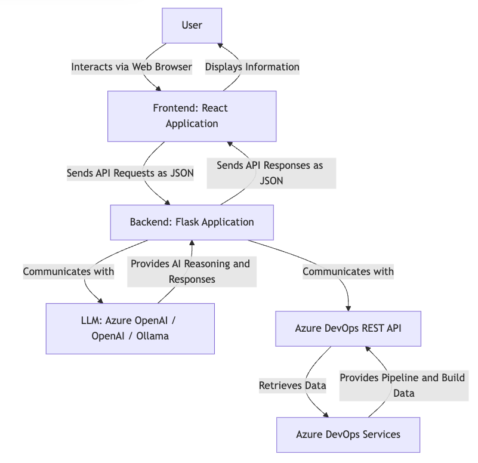

# Understanding the Internal Workings of the Azure Pipelines Analysis Agent

This document provides a detailed explanation of the internal architecture and functionality of the Azure Pipelines Analysis Agent. We will explore how different components interact to provide intelligent analysis of your Azure DevOps pipelines and builds, and clarify the role of each part, including the database setup.

## 1. Overall Architecture and Component Roles

The Azure Pipelines Analysis Agent is designed as a full-stack web application, adhering to a client-server model. It comprises a React-based frontend for user interaction and a Flask-based backend that houses the core AI logic and integrates with Azure DevOps. The communication between these two layers occurs via RESTful API calls.

At a high level, the architecture can be visualized as follows:

https://www.mermaidflow.app/editor

graph TD
    A["User"] -->|Interacts via Web Browser| B["Frontend: React Application"]
    B -->|Sends API Requests as JSON| C["Backend: Flask Application"]
    C -->|Communicates with| D["LLM: Azure OpenAI / OpenAI / Ollama"]
    C -->|Communicates with| E["Azure DevOps REST API"]
    E -->|Retrieves Data| F["Azure DevOps Services"]
    F -->|Provides Pipeline and Build Data| E
    D -->|Provides AI Reasoning and Responses| C
    C -->|Sends API Responses as JSON| B
    B -->|Displays Information| A

Each component plays a distinct and crucial role in the overall system:

*   **User:** The end-user who interacts with the application through a web browser to query pipeline information, analyze build failures, and receive insights.

*   **Frontend (React Application):** This is the client-side part of the application. It provides the graphical user interface (GUI) that users interact with. Its primary responsibilities include:
    *   Displaying chat messages (user queries and agent responses).
    *   Providing input fields for user messages.
    *   Allowing configuration of LLM providers and models.
    *   Displaying configuration status and available Azure DevOps projects.
    *   Making asynchronous API calls to the Flask backend to send user queries and retrieve agent responses.

*   **Backend (Flask Application):** This is the server-side component, built using the Python Flask web framework. It acts as the central hub, orchestrating interactions between the frontend, the Large Language Models (LLMs), and the Azure DevOps REST API. Its key functions include:
    *   Serving the static files of the React frontend.
    *   Exposing RESTful API endpoints for the frontend to communicate with (e.g., `/chat`, `/config`, `/set_llm_config`, `/projects`).
    *   Initializing and managing the LangChain agent, which is responsible for understanding user queries and executing appropriate actions.
    *   Handling authentication and authorization for Azure DevOps.
    *   Processing user requests, invoking the LLM, and utilizing specialized tools to interact with Azure DevOps.

*   **Large Language Model (LLM):** This is the 

intelligent core of the agent. It is responsible for:
    *   Understanding natural language queries from the user.
    *   Reasoning about which tools to use (e.g., `list_builds`, `get_build_logs`).
    *   Generating coherent and informative responses based on the tool outputs and its internal knowledge.
    The application is designed to be flexible, allowing users to choose between different LLM providers such as Azure OpenAI, OpenAI (via their public API), or Ollama (for local or self-hosted models).

*   **Azure DevOps REST API:** This is the interface through which the backend communicates with Azure DevOps Services. It allows the agent to programmatically access and retrieve data related to pipelines, builds, logs, and projects. The agent uses a Personal Access Token (PAT) for authentication.

*   **Azure DevOps Services:** The actual platform where your pipelines, builds, and code reside. The agent interacts with this service to fetch the necessary information for analysis.

## 2. Detailed Frontend (React) Functionality

The frontend of the Azure Pipelines Analysis Agent is a single-page application (SPA) built with React. It provides a user-friendly interface for interacting with the AI agent. Here's a breakdown of its key functionalities:

### 2.1. User Interface Components

The frontend is composed of several React components that manage the display and user interaction:

*   **Header:** Displays the application title ("Azure Pipelines Analysis Agent" or "Azura - The Guardian of Pipelines" after customization) and a brief description.

*   **Configuration Status Card:** This card dynamically displays the connection status for Azure DevOps and the configured LLM provider. It fetches this information from the backend's `/api/config` endpoint upon loading and updates it if the LLM configuration is changed. It uses visual cues (green checkmark for connected, red alert for not configured) and badges to indicate status.

*   **LLM Configuration Card:** This new section allows users to select their preferred LLM provider (Azure OpenAI, OpenAI, Ollama) from a dropdown and input the corresponding model name. When the "Update LLM Configuration" button is clicked, it sends a POST request to the backend's `/api/set_llm_config` endpoint to dynamically change the LLM used by the agent. This provides significant flexibility to the end-user.

*   **Sample Questions Card:** This card offers a list of predefined questions that users can click to quickly populate the input message field. This helps new users understand the capabilities of the agent and provides examples of valid queries.

*   **Chat Interface Card:** This is the central interaction area. It consists of:
    *   **Message Display Area:** A scrollable area that shows the conversation history between the user and the AI agent. User messages are displayed on the right, and bot messages on the left. Error messages from the bot are visually highlighted.
    *   **Input Field:** Where the user types their questions or commands. It supports multiline input and sends the message when the Enter key is pressed (without Shift).
    *   **Send Button:** Triggers the `sendMessage` function when clicked.

*   **Projects Info Card:** If successfully fetched from Azure DevOps, this card displays a list of available projects, providing context to the user about what projects the agent can query.

### 2.2. Data Flow and Interaction

The frontend primarily interacts with the backend via asynchronous `fetch` API calls. Here's a typical interaction flow:

1.  **Initial Load:** When the application loads in the browser, `useEffect` hooks trigger `checkConfig()` and `fetchProjects()` functions.
    *   `checkConfig()`: Makes a GET request to `/api/config` to retrieve the current Azure DevOps and LLM configuration status from the backend. This populates the Configuration Status and LLM Configuration cards.
    *   `fetchProjects()`: Makes a GET request to `/api/projects` to get a list of available Azure DevOps projects. This populates the Projects Info card.

2.  **Sending a Message:**
    *   When the user types a message in the input field and presses Enter or clicks the Send button, the `sendMessage()` function is called.
    *   The user's message is immediately added to the `messages` state and displayed in the chat interface.
    *   An `isLoading` state is set to `true` to show a typing indicator.
    *   A POST request is sent to the backend's `/api/chat` endpoint, with the user's message in the request body.

3.  **Receiving a Response:**
    *   Upon receiving a response from the backend, the `isLoading` state is set to `false`.
    *   If the backend response indicates `success: true`, the agent's response is added to the `messages` state and displayed.
    *   If `success: false` or an error occurs during the fetch, an error message is displayed in the chat interface.

4.  **Updating LLM Configuration:**
    *   When the user changes the LLM provider or model name and clicks "Update LLM Configuration", the `handleLLMConfigChange()` function is called.
    *   A POST request is sent to the backend's `/api/set_llm_config` endpoint with the new `llm_provider` and `llm_model_name`.
    *   The backend processes this request, re-initializes the LLM, and sends back a success or failure message. The frontend then alerts the user and refreshes the configuration status.

All state management in the frontend is handled using React's `useState` and `useEffect` hooks, ensuring a reactive and dynamic user experience. The `ScrollArea` component ensures that the chat automatically scrolls to the latest message.

## 3. Detailed Backend (Flask) Functionality and Agent Logic

The Flask backend is the powerhouse of the application, serving as the intermediary between the frontend and the external services (Azure DevOps and LLMs). It's structured using Flask Blueprints for modularity.

### 3.1. Core Components

*   **`main.py`:** This is the main entry point of the Flask application. It initializes the Flask app, configures CORS (Cross-Origin Resource Sharing) to allow communication with the frontend, and registers the `agent_bp` blueprint.

*   **`src/routes/agent.py`:** This file defines the API endpoints related to the AI agent and Azure DevOps interactions. It contains:
    *   **`agent_bp = Blueprint('agent', __name__)`:** Defines a Flask Blueprint for agent-related routes.
    *   **`initialize_agent()` function:** This crucial function is responsible for setting up the LangChain agent. It dynamically creates an LLM instance based on the `LLM_PROVIDER` and `LLM_MODEL_NAME` environment variables (which can be set via the `.env` file or dynamically updated by the frontend). It then defines the `tools` (functions that interact with Azure DevOps) and constructs the `AgentExecutor` using `create_openai_tools_agent`.
    *   **Tool Functions (`@tool` decorator):** These are Python functions decorated with `@tool` from LangChain. They encapsulate the logic for interacting with the Azure DevOps REST API:
        *   `list_builds(project, definition_id, status_filter, top)`: Fetches a list of builds for a given project, with optional filters.
        *   `get_build_logs(project, build_id)`: Retrieves the detailed logs for a specific build.
        *   `get_pipeline_definitions(project, top)`: Fetches definitions of pipelines within a project.
        These tools make `requests` to the Azure DevOps REST API, using the `AZURE_DEVOPS_PAT` for authentication.
    *   **API Endpoints:**
        *   `/chat (POST)`: Receives user messages from the frontend, invokes the `agent_executor` with the message, and returns the agent's response. This is where the LLM's reasoning and tool execution happen.
        *   `/config (GET)`: Returns the current configuration status of Azure DevOps and the LLM, including which LLM provider and model are currently active.
        *   `/set_llm_config (POST)`: Allows the frontend to dynamically update the `LLM_PROVIDER` and `LLM_MODEL_NAME` environment variables. This triggers a re-initialization of the LangChain agent with the new LLM.
        *   `/projects (GET)`: Fetches a list of available Azure DevOps projects.

### 3.2. LangChain Agent Workflow

The heart of the backend is the LangChain agent, which enables the application to understand and respond to natural language queries. Here's how it works:

1.  **User Query:** The frontend sends a user's natural language query (e.g., "List the last 5 failed builds for project MyProject") to the `/api/chat` endpoint.

2.  **Agent Invocation:** The Flask backend receives the query and invokes the `agent_executor` with the user's input.

3.  **LLM Reasoning:** The `agent_executor` passes the user's query to the configured LLM (e.g., GPT-4o). The LLM, guided by the `ChatPromptTemplate` and its understanding of the available `tools`, determines the best course of action. It might decide to:
    *   Directly answer the question if it has enough general knowledge.
    *   Call one or more of the defined tools (e.g., `list_builds`) to gather specific information from Azure DevOps.
    *   Engage in a multi-step reasoning process, calling tools sequentially and using their outputs to refine its understanding or generate a final answer.

4.  **Tool Execution:** If the LLM decides to use a tool, the `agent_executor` executes the corresponding Python function (e.g., `list_builds`). This function makes an HTTP request to the Azure DevOps REST API.

5.  **Azure DevOps Interaction:** The Azure DevOps REST API processes the request, authenticates using the provided PAT, and returns the requested data (e.g., a list of builds, build logs, pipeline definitions).

6.  **Response Generation:** The output from the tool (e.g., JSON data of builds) is fed back to the LLM as part of the `agent_scratchpad`. The LLM then uses this information to formulate a coherent and helpful natural language response for the user.

7.  **Frontend Display:** The Flask backend sends this natural language response back to the frontend, which then displays it in the chat interface.

This dynamic interaction allows the agent to perform complex tasks by breaking them down into smaller, tool-executable steps, all driven by the LLM's reasoning capabilities.

## 4. Clarifying Database Usage (SQLAlchemy)

During the initial setup of the Flask backend using the `manus-create-flask-app` utility, a default project structure is generated. This structure often includes boilerplate code for database integration, typically using `Flask-SQLAlchemy` and an SQLite database (`app.db`).

**Important Clarification:** In the current implementation of the Azure Pipelines Analysis Agent, **SQLAlchemy and the `app.db` SQLite database are NOT actively used for the core functionality of analyzing Azure Pipelines or storing chat history.**

Their presence in the project structure is a remnant of the Flask template. The agent's primary data interactions are with:

*   **Azure DevOps REST API:** For all pipeline and build-related data.
*   **Environment Variables:** For configuration details like Azure DevOps PAT, organization URL, and LLM API keys.

While the `src/models/user.py` and `src/database/app.db` files exist, they are not integrated into the agent's operational flow. If you were to extend this application to, for example, store user preferences, chat history persistently, or custom reports, then `Flask-SQLAlchemy` would become relevant. For the current scope of analyzing Azure Pipelines, you can largely ignore these database-related files.

This design choice simplifies the initial deployment and focuses on the core agentic capabilities. Should persistent storage be required in the future, the existing SQLAlchemy setup provides a convenient starting point for extension.

## Conclusion

The Azure Pipelines Analysis Agent leverages a modern web application architecture, combining a responsive React frontend with a powerful Flask backend. The backend's core intelligence is powered by a LangChain agent, which dynamically interacts with various LLMs and the Azure DevOps REST API to provide insightful analysis. While the initial template included database components, the current version focuses on direct API interactions, simplifying its deployment and operation for its primary purpose. This modular design allows for future enhancements, such as integrating persistent storage or additional data sources, with relative ease.

